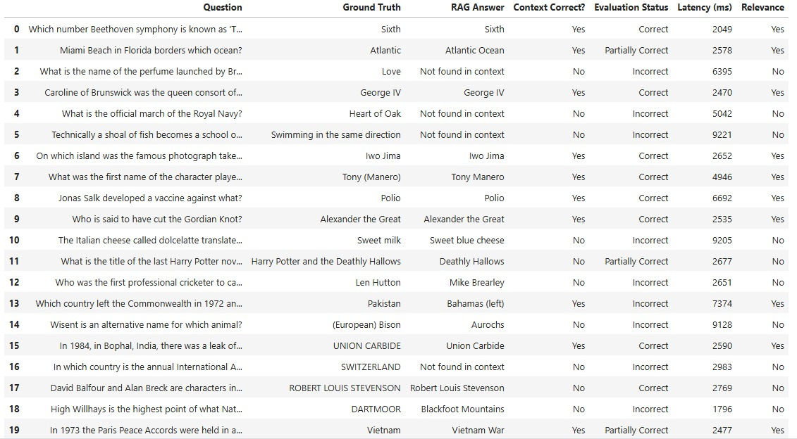

# Trivia-RAG-Explorer 🧠🔍

A Retrieval-Augmented Generation (RAG) system built to answer x open-domain questions from the **TriviaQA** dataset using a **local Mistral-7B LLM pipeline**.

---

## 🚀 Overview

This project implements a complete end-to-end RAG pipeline that leverages:

- LLM: **Mistral-7B (via HuggingFace)**
- Vector Database: **ChromaDB**
- Embedding Model: **sentence-transformers/all-MiniLM-L6-v2**
- Framework: **LangChain**
- API Layer: **FastAPI**

The system is optimized to process long-form documents (some exceeding 89k words) and retrieve the most relevant context to generate **short, evidence-based answers** grounded strictly in the retrieved text.

---

## 📊 Data Analysis & Chunking Strategy

Before building the vector store, a detailed statistical analysis was performed on the raw TriviaQA paragraphs to optimize retrieval quality and ensure compliance with the model token limits.

### 1. Original Data Insights

- Total Paragraphs: 5,541
- Median Length (P50): 1,038.00 words
- 90th Percentile (P90): 6,098.00 words
- Maximum Length: 89,615 words

The extreme variance in document length required a robust and carefully designed chunking strategy to preserve semantic relevance.

---

### 2. Optimized Chunking Results

- Total Chunks Generated: 128,151
- Average Words per Chunk: 158.20 words
- P90 Chunk Size: 193.00 words (optimized for the 256-token limit of all-MiniLM-L6-v2)
- Maximum Chunk Size: 234 words

**Chunking Effect Summary:**

- Original P90: 6,098 words
- Chunked P90: 193 words
- Reduction Factor: approximately 31.60x

This transformation significantly improves retrieval efficiency while maintaining contextual integrity.

---

## 🛠️ Data Cleaning & Pre-processing

To ensure high-quality embeddings and reduce noise, a specialized `clean_text` pipeline was implemented.

### Cleaning Logic

- Whitespace Normalization: Multiple spaces and line breaks are collapsed into a single space to improve embedding consistency.
- Semantic Thresholding: A minimum length of 15 characters is enforced.

**Rationale:**  
Short segments in TriviaQA often contain metadata such as page numbers, section headers, or editorial markers (e.g., "[Edit]"). The threshold effectively removes this noise while preserving concise factual statements essential for question answering.

---

## 🧩 System Architecture

The system follows a classic high-precision RAG architecture:

```
[TriviaQA Raw Dataset]
        |
        v
[preprocess.py] -- Clean + Chunk --> [chunks_metadata.json]
        |
        v
[vector_store.py] -- Embed --> [Chroma Vector DB]
        |
        v
[pipeline.py] -- run_rag() --> [RAG Output]
        |
        v
[app.py / API] --> [Answer + Context + Latency]
```
---

## 🧠 Prompt Design
```
A strict prompt is used to minimize hallucinations and enforce answer faithfulness:
<s>[INST] You are a helpful QA assistant. Use the following context to answer the question accurately. 
Keep the answer concise and direct. If the answer is not in the context, say "Not found in context".

Context: {context}
Question: {question} [/INST]
Answer:
```

**Answer Constraints:**
- 1–3 words only
- No explanations
- No full sentences
- Context-grounded answers only

---

## ⚙️ LLM Configuration

The generation pipeline is tuned for determinism and factual accuracy:

- Temperature: 0
- Max New Tokens:64
- Sampling: Disabled (do_sample = False)
- return_full_text=False

This configuration prioritizes precision over creativity and reduces hallucinations.

---

## 📊 Evaluation & Performance Summary

The system was benchmarked using a dedicated evaluation script (`evaluate.py`) on a subset (20 QA) of the TriviaQA dataset.



### Evaluation Metrics

| Metric           | Result      |
|------------------|-------------|
| Accuracy         | 55.00%      |
| Relevance        | 50.00%      |
| Average Latency  | 4411.5 ms   |

**Notes:**
- Accuracy includes both **Correct** and **Partially Correct** answers.
- Relevance measures how often the ground-truth answer appears in the retrieved context.
- The system demonstrates strong faithfulness, preferring to return `"Not found in context"` rather than hallucinating unsupported answers.

---

## 📦 Repository Structure
```
├── Dockerfile               # Containerization script
├── requirements.txt         # Python dependencies
├── embedding_model.py       # Sentence embedding model setup
├── llm_model.py             # LLM (Mistral-7B) setup
├── preprocess.py            # TriviaQA preprocessing & chunking
├── vector_store.py          # Build vector DB from chunks
├── pipeline.py              # Core RAG execution logic
├── app.py                   # FastAPI for API
├── evaluate.py              # Evaluation script
└── README.md
```

---

## 🐳 Setup & Docker Instructions

### 1. Docker Setup

```bash
        # Build the Docker image
        docker build -t trivia-rag .
```
# Run the container
```bash
        docker run -p 8050:8050 trivia-rag
```

### 2. Manual Setup

``` bash
        git clone <repo_url>
        cd Trivia-RAG-Explorer
        pip install -r requirements.txt
```

**Indexing:**
        
```bash
        python preprocess.py
        python vector_store.py
```

**Run API:**
```bash 
        python app.py
```
        
**Send POST requests to:**
```bash
        http://localhost:8050/query
```
        
**Payload example:**
```json
       {
        "question": "Which country left the Commonwealth in 1972?"
      }
 ```
        
---
# **Usage Notes**
  - GPU Recommended: For optimal latency (<5 seconds), running on a T4 or A100 GPU is strongly recommended.
    
  - Strict Answering: All answers are limited to 1–3 words and must appear in the retrieved context.

  - Error Handling:
    
      - Empty or whitespace-only queries return: ``` Empty query received ```.
      - Missing evidence returns: ``` Not found in context```.
    


   

